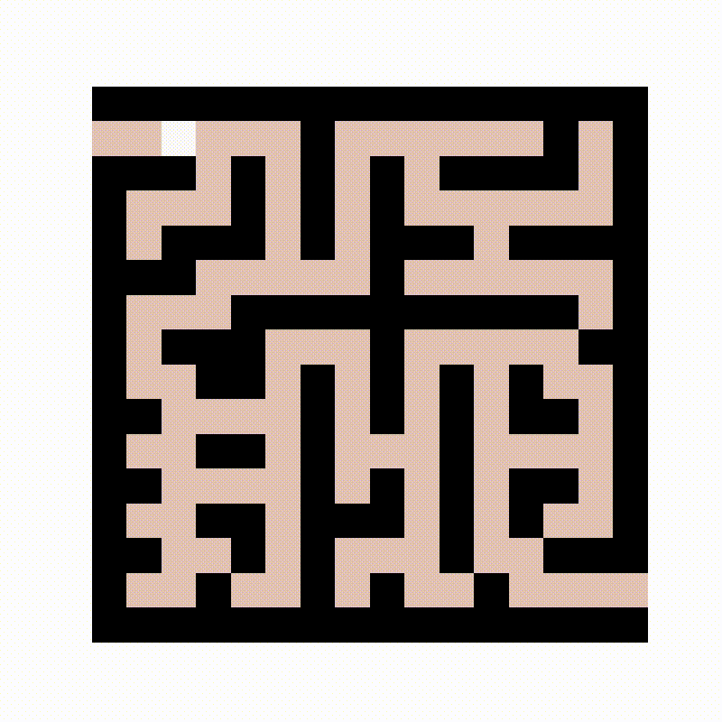

# Maze Solving Robot using Reinforcement Learning
Reinforcement learning is a technique which allows a system to learn from the environment through actions.

Agent: Bot

Environment: A grid, it can be a 16x16 maze

States: Let‘s say we are considering a grid as our maze, so each node of that grid is an individual states, so for 16X16 maze there will be total 255 states

Action: In that grid the agent can move left, right, up and down. These are the available actions for that agent

Reward: I am going to define the reward value from -1 to 1. Since I am going to find an efficient way to solve the maze, each step from one state to another state will cost -0.01, so that it will minimize the total steps. For the blocked path, the wall, I am defining the reward value as the -1, so that the agent never choose that state . For the goal state I am defining the reward value as highest 10.

Goal: The goal is to reach the last state of that grid

## Output Visualization

